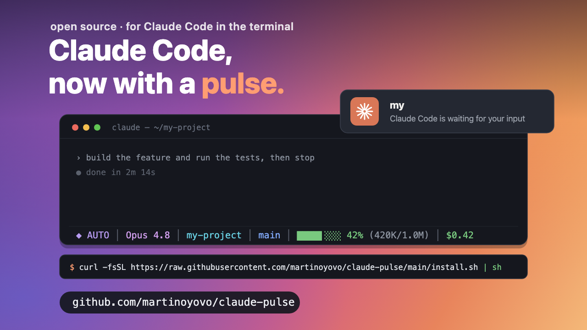

# claude-pulse



A tiny [Claude Code](https://claude.com/claude-code) companion that bundles two
things in one repo:

1. **A status line** — the bar Claude Code renders at the bottom of the TUI.
2. **Desktop notifications** — fired via hooks when Claude finishes a turn or
   needs your attention.

It's the Claude Code counterpart to [`codex-pulse`](https://github.com/martinoyovo/codex-pulse).
Dependency-light: portable `bash`/`sh` + `jq` (and `git` for the branch
segment). No frameworks.

## Preview

The status line is a single, color-coded line:

```
◆ PLAN │ Opus 4.8 │ margin-website │ main* │ Bash 105 │ +128/−34 │ ████▊░░░░░ 48% (480K/1.0M) │ 8m │ $2.47
```

| Segment | Shows | Color |
| --- | --- | --- |
| `◆ PLAN` | Session mode — only shown when **not** normal (`plan` / `acceptEdits` / `bypassPermissions`) | purple / yellow / red |
| `Opus 4.8` | Model display name | magenta |
| `margin-website` | Current directory (basename) | cyan |
| `main*` | Git branch — `*` means dirty working tree | blue / yellow `*` |
| `Bash 105` | Most-used tool this session + count | purple |
| `+128/−34` | Lines added / removed this session | green / red |
| `████▊░░░░░ 48% (480K/1.0M)` | Context-window usage + tokens (green → yellow → red) | by threshold |
| `8m` | Session duration | gray |
| `$2.47` | Session cost so far | green |

Every segment is optional — hide any with `CLAUDE_PULSE_HIDE`. The `mode`,
`tools`, `lines`, and `duration` segments only appear when they have something
to show.

Notifications look like:

- **Claude Code needs your input** — when a turn ends and it's waiting on you
  (`Stop`).
- **Claude Code needs your permission…** — when Claude Code is waiting on you,
  e.g. a permission prompt (`Notification`; the actual prompt text is used when
  available, rebranded to "Claude Code").

## Install

```sh
git clone https://github.com/martinoyovo/claude-pulse.git
cd claude-pulse
./install.sh
```

Or one-shot:

```sh
curl -fsSL https://raw.githubusercontent.com/martinoyovo/claude-pulse/main/install.sh | sh
```

The installer:

- copies `statusline.sh` and `notify.sh` to `~/.claude/claude-pulse/`, and
- **merges** the `statusLine` and `hooks` blocks into `~/.claude/settings.json`
  without clobbering your existing config. Re-running is idempotent.

Then **restart Claude Code** (or start a new session) for the status line to
appear. The first time a hook runs, Claude Code may ask you to trust it.

The installer also adds a `claude-pulse` command (symlinked onto your `PATH`):

```sh
claude-pulse update         # re-install the latest version from GitHub
claude-pulse test           # fire a test notification (or: claude-pulse test notify)
claude-pulse icons nerd     # set icons: nerd | emoji | symbols | off (no arg = show current)
claude-pulse uninstall      # remove claude-pulse
claude-pulse version
```

### Updating

```sh
claude-pulse update
```

claude-pulse doesn't auto-update — your installed copy is frozen at install
time. `claude-pulse update` re-fetches the latest from GitHub and reinstalls in
place (idempotent; your settings are preserved). If the command isn't on your
`PATH`, just re-run the `curl … | sh` one-liner.

### Manual install

Copy the scripts wherever you like and add the blocks from
[`settings.example.json`](settings.example.json) to `~/.claude/settings.json`:

```sh
mkdir -p ~/.claude/claude-pulse
cp statusline.sh hooks/notify.sh ~/.claude/claude-pulse/
chmod +x ~/.claude/claude-pulse/*.sh
```

## Configuration

Set these as environment variables, or — easier — edit
`~/.claude/claude-pulse/config.sh`, which the scripts source on every run and
which **survives `claude-pulse update`**. The installer drops a commented
template there. Example:

```sh
# ~/.claude/claude-pulse/config.sh
CLAUDE_PULSE_NERD=1        # use Nerd Font icons
CLAUDE_PULSE_BAR_WIDTH=12  # a slightly longer bar
```

### Icons (optional)

By default the status line is **clean text — no icons** — so it renders on any
terminal with zero setup. If you want little glyphs in front of each segment,
there are three opt-in modes:

- **Nerd Font** (`CLAUDE_PULSE_NERD=1`) — crisp monochrome icons. **Requires a
  Nerd Font** installed *and* selected as your terminal font, or you'll see
  hollow boxes (`􏿿`). To set it up on macOS:
  ```sh
  brew install --cask font-jetbrains-mono-nerd-font
  ```
  Then point your terminal at it — **Terminal.app:** Settings → Profiles → Text →
  Font → *JetBrainsMono Nerd Font*; **iTerm2:** Settings → Profiles → Text → Font.
  ([More Nerd Fonts →](https://www.nerdfonts.com/font-downloads))
- **Emoji** (`CLAUDE_PULSE_EMOJI=1`) — 🤖 📁 🌿 …; renders on any terminal, no font.
- **Symbols** (`CLAUDE_PULSE_SYMBOLS=1`) — plain Unicode (`✦ ▸ ⎇ ▦ ⚙ ◷`); no font,
  no emoji, works in most terminals.

Set one in `config.sh`, then open a new session. If glyphs show as boxes, your
terminal font isn't a Nerd Font — install one as above, or use a different mode.

### Status line (`statusline.sh`)

| Variable | Default | Effect |
| --- | --- | --- |
| `CLAUDE_PULSE_NERD` | `0` | Set to `1` for crisp [Nerd Font](https://www.nerdfonts.com/) glyphs — **requires a Nerd Font** installed and selected in your terminal, or you'll see boxes. |
| `CLAUDE_PULSE_EMOJI` | `0` | Set to `1` for emoji icons (🤖 📁 🌿 …) — renders on any terminal with no font needed. Default is clean text (no icons), which works everywhere. |
| `CLAUDE_PULSE_TOKENS` | `1` | Show token counts after the % — e.g. `38% (388K/1.0M)`. Set to `0` to hide. |
| `CLAUDE_PULSE_BAR_WIDTH` | `10` | Width of the context bar, in cells. |
| `CLAUDE_PULSE_CONTEXT_LIMIT` | auto | Override the context-window size in tokens. Auto-detects 1M for `…1m…` model ids, else 200k — and steps 200k → 1M automatically if usage exceeds 200k (so a 1M session never gets stuck pegged at 100%). |
| `CLAUDE_PULSE_HIDE` | _(none)_ | Comma list of segments to hide: `mode`, `model`, `dir`, `branch`, `tools`, `lines`, `context`, `duration`, `cost`. |
| `NO_COLOR` | _(unset)_ | Standard [`NO_COLOR`](https://no-color.org/) — disables all ANSI color. |

The context-window percentage isn't in Claude Code's status payload, so
`statusline.sh` reads it from the session transcript (the most recent turn's
token usage = `input + cache_read + cache_creation`).

### Notifications (`notify.sh`)

The notification mirrors Claude.app's structure: the **title** is the project
folder name (so you can tell which session is waiting when several are open) and
the **message** is the status.

| Variable | Default | Effect |
| --- | --- | --- |
| `CLAUDE_PULSE_NOTIFY` | `auto` | Backend: `auto`, `terminal-notifier`, `alerter`, `notify-send`, `osa`, `osc9`, `bell`, `off`. |
| `CLAUDE_PULSE_NOTIFY_TITLE` | folder name | Override the notification title. |
| `CLAUDE_PULSE_NOTIFY_ICON` | _(none)_ | PNG path used as the icon (for `notify-send` / the plain `terminal-notifier` fallback). |
| `CLAUDE_PULSE_NOTIFY_SENDER` | _(off)_ | macOS bundle id for `terminal-notifier` (opt-in; see icon note below). |
| `CLAUDE_PULSE_NOTIFY_SKIP_FOCUSED` | `1` | macOS: skip the alert when the terminal tab running this session is the focused window — you're already looking at it. Per-tab precision on Terminal.app & iTerm2 (a *different* tab/window still notifies); app-level elsewhere. Set to `0` to always notify. Fails open. |
| `CLAUDE_PULSE_NOTIFY_IDLE` | `0` | Claude Code re-pings "waiting for your input" ~60s after a turn ends; that duplicates the `Stop` alert, so it's skipped. Set to `1` to keep that idle reminder too. (Permission prompts always fire.) |
| `CLAUDE_PULSE_NOTIFY_FOCUS_ON_CLICK` | `1` | macOS: clicking the notification jumps to the exact terminal tab that pinged you (matched by TTY). Terminal.app & iTerm2. Set to `0` to disable. |
| `CLAUDE_PULSE_NOTIFY_SOUND` | `default` | Notification sound, played via `afplay` (terminal-notifier's own `-sound` is ignored for the bundled app). `default` = your configured macOS **alert sound** (System Settings → Sound); a name like `Ping`/`Glass`/`Hero`/`Submarine`; or `off`. Silent under Do Not Disturb / Focus. |

`auto` tries, in order: `terminal-notifier` → `alerter` → `notify-send`
(Linux) → `osascript` (macOS) → terminal bell / OSC-9 escape.

**About the icon (the Claude logo).** A notification shows the icon of the app
that posts it. On macOS the installer builds a small Claude-branded notifier —
`ClaudePulse.app`, a rebranded copy of `terminal-notifier` carrying the icon
from your local Claude.app — and posts through it, so alerts show the Claude
logo. This needs `terminal-notifier` and `codesign` (Xcode Command Line Tools);
macOS may ask you to allow notifications the first time. If it can't be built,
it falls back to the plain notifier (system icon). On Linux, set
`CLAUDE_PULSE_NOTIFY_ICON` to a PNG to show one via `notify-send -i`.
(`terminal-notifier`'s `-sender` flag — the other way to set the icon — hangs
for Claude's bundle id, so it's opt-in only via `CLAUDE_PULSE_NOTIFY_SENDER`.)

On macOS the built-in `osascript` fallback shows notifications as *Script
Editor*. For a cleaner source, install `terminal-notifier`:

```sh
brew install terminal-notifier
```

## Test

Status line — pipe it a sample payload:

```sh
echo '{"model":{"display_name":"Opus 4.8"},"cwd":"'"$PWD"'","cost":{"total_cost_usd":0.42}}' \
  | ~/.claude/claude-pulse/statusline.sh
```

Notification hook:

```sh
echo '{"hook_event_name":"Stop","cwd":"'"$PWD"'"}' | ~/.claude/claude-pulse/notify.sh   # title=folder, "Claude Code is waiting for your input"
echo '{"hook_event_name":"Notification","message":"Permission needed","cwd":"'"$PWD"'"}' \
  | ~/.claude/claude-pulse/notify.sh                                        # title=folder, "Permission needed"
```

Real Claude Code test — paste these prompts into a session:

```text
Run `sleep 8; echo claude-pulse notification test complete` and then stop.
```

Switch away while it sleeps. The notification's title is the project folder and
the message is **Claude Code is waiting for your input**.

```text
Run `open -a Calculator` so I can test the approval notification.
```

Switch away when Claude asks to approve the command. You should get the
permission prompt text (rebranded to **Claude Code**). This only fires if the
command isn't already auto-approved — if `open` is allowlisted in your settings,
use one that isn't, e.g. ``Run `osascript -e 'beep'` ``.

## Uninstall / revert

claude-pulse takes over the single `statusLine` slot while installed, but the
takeover is fully reversible — `install.sh` saves your previous status line
first.

```sh
claude-pulse uninstall                  # remove everything, restore your previous status line
~/.claude/claude-pulse/uninstall.sh --statusline   # revert ONLY the status line, keep notifications
```

- **Full uninstall** removes `~/.claude/claude-pulse/` and strips claude-pulse's
  `statusLine` and hook entries from `~/.claude/settings.json`, restoring your
  previous status line if one was saved (otherwise the slot is cleared). The
  rest of your config is left intact.
- **`--statusline`** backs the status-line change out at any time — it restores
  your previous status line (or clears ours) while leaving the notification
  hook and installed files in place. Re-run `install.sh` to take it over again.

A full uninstall also deregisters the bundled notifier app from LaunchServices.
The one thing it can't force-remove is the **"Claude Code" entry under System
Settings → Notifications** — macOS keeps notification-permission records even
after an app is deleted. It's harmless and clears on its own.

Run `./uninstall.sh --help` for details.

## Notes

- **First click asks for permission.** The first time you click a notification
  (click-to-focus), macOS shows a one-time prompt to let the notifier control
  Terminal/iTerm (Automation permission). Allow it — that first click is consumed
  by the dialog; every click afterward jumps straight to the tab. This can't be
  pre-granted; it's macOS's by-design approval.
- Hooks are not supported on Windows shells; the notifier exits quietly there.
- Everything degrades gracefully: missing fields, no transcript, no `jq`, or no
  `git` just drop the affected segment rather than erroring.
- Status-line design modeled on
  [agy-statusline](https://codeberg.org/jochenkirstaetter/agy-statusline) by
  Jochen Kirstaetter (single `jq` pass, ANSI colors, Nerd Font + plain
  fallback, fast git branch/dirty), adapted to Claude Code's payload and a
  compact one-line layout.

## License

MIT, copyright 2026 Martino Yovo. See [LICENSE](LICENSE).
